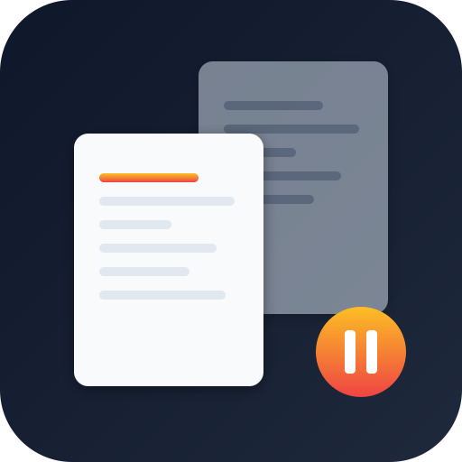

<div align="center">



# 🔥 CodeCloner

**克隆一切：抄代码 ↔ 抄网页，同一个工具搞定。**

**Clone anything — open-source repos AND websites. One tool, two modes.**

[](https://github.com/Eamon3949/CodeCloner)
[](./LICENSE)
[](#-怎么安装--how-to-install)
[](#-支持的平台--supported-platforms)
[](#-模块概览--modules-overview)

**[🇨🇳 中文](#-这是什么)** | **[🇬🇧 English](#-what-is-this)**

</div>

---

## 🇨🇳 这是什么？

CodeCloner 现在有**两个本事**：

**模块一：抄代码（原「抄袭者」）**

你看到一个开源项目，心想：**"这东西真好，要是叫我的名字就好了。"**

CodeCloner 的抄袭者模式会自动帮你：
1. 🔍 查清项目能不能抄、怎么抄（许可证检查）
2. 📋 大白话告诉你项目是什么、有什么、要改哪里
3. ✏️ 按你的要求改名字、换品牌、删功能、加功能
4. ✅ 验证改完的东西能跑
5. 📦 打包交付，推到你的仓库

**模块二：抄网页（新增）**

你看到一个网站设计得好看，心想：**"这个页面要是能离线打开就好了。"**

CodeCloner 的抄网页模式会自动帮你：
1. 🌐 用浏览器加载目标网址
2. 🔒 绕过 CDN 403，直接抓取所有 CSS 和图片
3. 📦 把 CSS 内联、图片 base64，生成一个单文件 HTML
4. 🖼️ 截屏留档
5. 📤 交付给你，浏览器直接打开，完全离线可用

**全程不用写一行代码。你只管丢链接，AI 帮你干活。**

### 🌐 支持的平台

CodeCloner 不绑定任何平台——任何能读 markdown 指令的 AI Agent 都能用：

| 平台 | 怎么用 |
|:----:|--------|
| 🟣 **Claude Code** | 原生 Skill 格式，直接放到 `~/.claude/skills/` 或项目 `.claude/skills/` |
| 🟢 **OpenAI Codex** | 把 SKILL.md 内容贴进项目根目录的 `AGENTS.md` 或作为 system prompt |
| 🟡 **OpenClaw** | 作为 Agent 指令文件导入，或贴进对话开头 |
| 🔵 **Hermes Agent** | 作为 skill/instruction 文件加载，或贴进 system prompt |
| 🔘 **其他 AI Agent** | 只要能读 markdown 规则，就能用 |

### 📦 怎么安装？

**Claude Code**

```bash
# 全局安装（所有项目都能用）
git clone https://github.com/Eamon3949/CodeCloner.git ~/.claude/skills/CodeCloner

# 项目级安装（只在当前项目能用）
git clone https://github.com/Eamon3949/CodeCloner.git .claude/skills/CodeCloner
```

装完后在任何对话里输入以下关键词即可触发：

| 你想干什么 | 说这个 |
|-----------|--------|
| 抄代码仓库（改名换姓） | `[激活抄袭者] https://github.com/xxx/yyy` |
| 抄网页（离线保存） | `[抄网页] https://example.com` |
| 自动判断 | 直接丢链接，系统自动判断走哪个模块 |

> **抄网页需要额外装 Playwright 浏览器内核**（AI Agent 会自动帮你装，不用操心）

**OpenAI Codex**

```bash
cp SKILL.md /your/project/AGENTS.md
```

**OpenClaw / Hermes Agent / 其他平台**

把 `SKILL.md` 的内容复制粘贴到对话开头，或作为 system prompt / instruction 文件导入。

### ✨ 核心特点

| 特点 | 说明 |
|:----:|------|
| 🛡️ **许可证把关** | 抄代码时自动检查 MIT / Apache / GPL 等许可证，告诉你能不能抄、要遵守什么 |
| 🔤 **命名全覆盖** | 抄代码时 PascalCase、camelCase、kebab-case、snake_case、常量、URL 全部替换，一个不漏 |
| 🧹 **品牌清洗** | 抄代码时按 P0 / P1 / P2 优先级逐项清洗，内置 0-100 分干净度评分系统 |
| 🔒 **CDN 破解** | 抄网页时 CDN 403 防盗链也没用，浏览器能看 = 就能拿到资源 |
| 🎯 **1:1 复刻** | 抄网页时 CSS 全部内联 + 图片 base64，与原站几乎一致 |
| 💬 **大白话汇报** | 全程用你听得懂的话解释，不懂代码也能做决策 |
| 🔇 **静音模式** | 加上 `--auto` 全自动跑，只在你需要的时候才打断你 |
| 📖 **参考文档** | 附带 7 份详细参考（工作流、品牌清单、命名变体、评分系统、页面克隆等） |

### 🚀 怎么用？

**你需要什么？**

- **抄代码**：一个 Git 平台账号 + Git + AI Agent 工具
- **抄网页**：AI Agent 工具 + Playwright（会自动安装）
- **不需要懂代码**

**抄代码：三步搞定**

```
第 1 步 ── 发送项目链接
你：https://github.com/某人/某个项目 [激活抄袭者]

第 2 步 ── 看报告，提需求
AI：📋 可行性报告：MIT 协议 ✅ 可以抄，约 120 个文件，预计分 2-3 批改完
你：项目叫 MyApp，去掉社区功能

第 3 步 ── 等交付
AI：✅ 改完了！已推送到你的仓库
```

**抄网页：也是三步搞定**

```
第 1 步 ── 发送网址
你：[抄网页] https://example.com

第 2 步 ── 等克隆
AI：🌐 正在加载页面...  ✅ CSS 17 个（734KB）全部内联 ✅ 图片 16 张全部 base64

第 3 步 ── 打开看效果
AI：✅ 已生成 full_clone.html（9.2MB），浏览器打开直接看
```

**静音模式**

```
你：https://github.com/某人/某个项目 [激活抄袭者] --auto
AI：（安静地干活，只在出问题时才打断你）
```

### 🔄 工作流一览

```
┌─────────────┐
│  第 0 步     │  🛡️ 可行性评估 → 许可证检查 / 规模评估 / 技术栈检查
└──────┬──────┘
       │ ✅ 可行
       ▼
┌─────────────┐
│  第 1 步     │  🔍 项目拆解 → 克隆仓库 / 分析结构 / 识别品牌要素
└──────┬──────┘
       ▼
┌─────────────┐
│  第 2 步     │  📋 大白话汇报 → 一句话说清楚 / 核心亮点 / 问你想改什么
└──────┬──────┘
       ▼
┌─────────────┐
│  第 3 步     │  ✏️ 交互式重构 → 品牌清洗 / 功能裁剪 / 功能增强
└──────┬──────┘
       ▼
┌─────────────┐
│  第 4 步     │  ✅ 冒烟验证 → 编译检查 / 安全扫描 / 运行验证 / 干净度评分
└──────┬──────┘
       ▼
┌─────────────┐
│  第 5 步     │  📦 极简交付 → Dockerfile / 一键启动脚本 / 推送仓库
└─────────────┘
```

### 📏 干净度评分系统

| 维度 | 满分 | 扣分规则 | 说明 |
|:----:|:----:|:--------|:-----|
| **P0 核心替换** | 40 | 每处残留扣 5 分 | 项目名没换完 = 侵权风险 |
| **P0 包名/import** | 30 | 每处残留扣 10 分 | import 路径没改 = 项目跑不起来 |
| **P1 文档配置** | 15 | 每处残留扣 3 分 | README、package.json 里的旧名 |
| **P2 辅助信息** | 15 | 每处残留扣 1 分 | CHANGELOG 中的历史记录 |

| 分数 | 等级 | 结论 |
|:----:|:----:|:-----|
| **95-100** | 🟢 A | 可以放心推送 |
| **80-94** | 🟡 B | 可以交付，P2 有合理残留 |
| **60-79** | 🟠 C | 不建议交付，继续洗 |
| **< 60** | 🔴 D | **禁止交付** |

### ⚖️ 许可证支持

| 许可证 | 能不能抄 | 归因要求 |
|:------:|:--------:|---------|
| MIT | ✅ 能 | 保留版权声明 |
| Apache-2.0 | ✅ 能 | 保留版权 + NOTICE |
| BSD | ✅ 能 | 保留版权声明 |
| GPL | ⚠️ 能 | 你的项目也必须开源 |
| AGPL | ⚠️ 能 | 网络服务也要开源 |
| Unlicense | ✅ 能 | 无要求 |
| 无许可证 | 🚫 不能 | 法律上 = 保留所有权利 |

### ⚠️ 注意事项

- 本 Skill 产生的项目基于原项目的开源许可证，请遵守原作者的许可条款
- GPL / AGPL 项目抄完后**必须同样开源**，这是法律要求，不是建议
- 不要删除原作者的 LICENSE 文件，而是替换版权声明中的作者名和项目名
- 商业使用请确保获得原项目作者授权

### 📁 项目结构

```
CodeCloner/
├── SKILL.md                         ← 技能入口（路由规则 + 6 步工作流）
├── VERSION                          ← 版本号
├── LICENSE                          ← MIT 许可证
├── CHANGELOG.md                     ← 变更日志
├── logo.svg                         ← 项目 Logo
├── README.md                        ← 你正在看的这个文件
├── .gitignore
│
├── references/                      ← 抄代码模块参考文档
│   ├── workflow.md                  ← 详细工作流（含技术栈决策树）
│   ├── branding-checklist.md        ← 品牌清洗检查清单
│   ├── naming-variants.md           ← 命名变体映射规则
│   └── cleanliness-score.md         ← 干净度评分系统
│
└── cloner-web/                      ← 抄网页模块
    ├── SKILL.md                     ← 网页克隆专属规则
    ├── scripts/
    │   └── clone_intercept.py       ← Playwright 拦截脚本
    └── references/
        └── page-cloning-notes.md    ← 页面克隆技术笔记
```

### 📖 参考文档速览

| 文档 | 一句话说明 |
|------|-----------|
| [workflow.md](./references/workflow.md) | 抄代码：每一步具体干什么、怎么干、遇到问题怎么办 |
| [branding-checklist.md](./references/branding-checklist.md) | 抄代码：品牌清洗 P0/P1/P2 优先级清单 + grep 模板 |
| [naming-variants.md](./references/naming-variants.md) | 抄代码：8 种命名变体全覆盖规则 |
| [cleanliness-score.md](./references/cleanliness-score.md) | 抄代码：0-100 分干净度评分系统 |
| [cloner-web/SKILL.md](./cloner-web/SKILL.md) | 抄网页：完整工作流和操作指南 |
| [cloner-web/scripts/clone_intercept.py](./cloner-web/scripts/clone_intercept.py) | 抄网页：Playwright 响应拦截脚本 |
| [cloner-web/references/page-cloning-notes.md](./cloner-web/references/page-cloning-notes.md) | 抄网页：技术原理和已知陷坑 |

### 🤝 参与贡献

欢迎贡献！你可以：

- **提 Bug** — 在 [Issues](https://github.com/Eamon3949/CodeCloner/issues) 里描述问题
- **提建议** — 在 Issues 里标记为 `enhancement`
- **提 PR** — Fork 仓库，改完后提 Pull Request
- **加平台** — 如果你用过的 AI Agent 平台不在列表里，告诉我们怎么适配

贡献前请确保：
- 改动不影响 SKILL.md 的通用性（不要加平台特定的硬编码）
- 新加的参考文档放在 `references/` 下
- 更新 CHANGELOG.md

---

## 🇬🇧 What is this?

You found an amazing open-source project. You love it. But it's not yours.
Or you saw a beautiful website that you wish you could save offline.

**CodeCloner now does both.**

**Module 1: Clone Code (the original "Cloner")**

Clone any open-source repo, rebrand it, and ship it as your own. Just say **`[activate cloner]`** + repo URL.

1. 🔍 License check — can you legally clone this?
2. 📋 Plain-language report — what does it do, what needs changing
3. ✏️ Interactive rebranding — rename, recolor, remove, add
4. ✅ Smoke test — does it still run?
5. 📦 Ship — push to your own repo

**Module 2: Clone Web (new!)**

Clone any website into a self-contained single HTML file. Say **`[clone web]`** + URL.

1. 🌐 Browser loads the page (Playwright)
2. 🔒 Intercepts all CSS & images *inside the browser* — bypasses CDN 403
3. 📦 Inlines CSS + base64 images → single standalone HTML
4. 🖼️ Screenshot for reference
5. 📤 Delivers — open in browser, works offline

**Zero coding. Just drop a link, let the AI do the work.**

### 🌐 Supported Platforms

CodeCloner is not locked to any single platform — any AI agent that reads markdown instructions can use it:

| Platform | How to use |
|:--------:|------------|
| 🟣 **Claude Code** | Native Skill format — drop into `~/.claude/skills/` or project `.claude/skills/` |
| 🟢 **OpenAI Codex** | Paste SKILL.md content into your project's `AGENTS.md` or use as system prompt |
| 🟡 **OpenClaw** | Import as agent instruction file, or paste at the start of a conversation |
| 🔵 **Hermes Agent** | Load as skill/instruction file, or paste into system prompt |
| 🔘 **Other AI Agents** | If it reads markdown rules, it works |

### 📦 How to Install?

**Claude Code**

```bash
# Global install (available in all projects)
git clone https://github.com/Eamon3949/CodeCloner.git ~/.claude/skills/CodeCloner

# Project-level install (current project only)
git clone https://github.com/Eamon3949/CodeCloner.git .claude/skills/CodeCloner
```

Then type `[activate cloner]` + a project URL in any conversation to trigger it.

**OpenAI Codex**

```bash
cp SKILL.md /your/project/AGENTS.md
```

**OpenClaw / Hermes Agent / Other platforms**

Copy-paste the content of `SKILL.md` at the start of your conversation, or import it as a system prompt / instruction file. It's universal markdown — no special adaptation needed.

### ✨ Key Features

| Feature | Description |
|:-------:|-------------|
| 🛡️ **License Guard** | Automatically checks MIT / Apache / GPL licenses — tells you if you can clone it and what you must comply with |
| 🔤 **Full Name Coverage** | Not just a find-and-replace — handles PascalCase, camelCase, kebab-case, snake_case, SCREAMING_SNAKE, constants, and URLs. All 8 variants, zero misses |
| 🧹 **Brand Cleanup** | P0 / P1 / P2 priority-based cleanup with a built-in 0-100 Cleanliness Score system |
| 💬 **Plain Language Reports** | Explains everything in terms anyone can understand — no coding knowledge needed |
| 🔇 **Silent Mode** | Add `--auto` for fully hands-off operation. Only interrupts you when it really needs to |
| 📖 **Reference Docs** | 4 detailed references included (workflow, branding checklist, naming variants, scoring system) |

### 🚀 How to Use?

**What you need:**

- A GitHub / GitLab / Bitbucket account
- [Git](https://git-scm.com/) installed
- [Claude Code](https://docs.anthropic.com/en/docs/claude-code) or [Codex](https://openai.com/codex/) or another AI Agent tool installed
- For auto-push: [GitHub CLI (gh)](https://cli.github.com/) installed
- **No coding knowledge required**

**Three steps:**

```
Step 1 ── Send the project URL
You: https://github.com/someone/some-project [activate cloner]

Step 2 ── Read the report, give instructions
AI:  📋 Feasibility: MIT license ✅, ~120 files, 2-3 batches estimated
You: Name it MyApp, remove the community features

Step 3 ── Wait for delivery
AI:  ✅ Done! Pushed to your repository
```

**Silent mode**

Don't want step-by-step questions? Add `--auto` — the AI runs on defaults and only interrupts if something goes wrong:

```
You: https://github.com/someone/some-project [activate cloner] --auto
AI:  (quietly working, only asks when something needs your decision)
```

### 🔄 Workflow at a Glance

```
┌─────────────┐
│  Step 0     │  🛡️ Feasibility → License check / Scale assessment / Tech stack
└──────┬──────┘
       │ ✅ viable
       ▼
┌─────────────┐
│  Step 1     │  🔍 Analysis → Clone repo / Map structure / Identify brand elements
└──────┬──────┘
       ▼
┌─────────────┐
│  Step 2     │  📋 Briefing → One-liner summary / Key highlights / Ask what to change
└──────┬──────┘
       ▼
┌─────────────┐
│  Step 3     │  ✏️ Rebranding → Brand cleanup / Feature trimming / Feature additions
└──────┬──────┘
       ▼
┌─────────────┐
│  Step 4     │  ✅ Verification → Compile check / Security scan / Runtime test / Cleanliness score
└──────┬──────┘
       ▼
┌─────────────┐
│  Step 5     │  📦 Delivery → Dockerfile / One-click scripts / Push to repo
└─────────────┘
```

### 📏 Cleanliness Score System

How clean is "clean enough"? We quantify it:

| Dimension | Max | Deduction | Meaning |
|:---------:|:---:|:---------:|---------|
| **P0 Core Names** | 40 | -5 per miss | Unreplaced project names = legal risk |
| **P0 Imports** | 30 | -10 per miss | Unreplaced imports = project won't run |
| **P1 Docs/Config** | 15 | -3 per miss | Old names in README, package.json, etc. |
| **P2 Misc** | 15 | -1 per miss | Historical entries in CHANGELOG |

| Score | Grade | Verdict |
|:-----:|:-----:|---------|
| **95-100** | 🟢 A | Ship it |
| **80-94** | 🟡 B | Deliverable, minor P2 residue |
| **60-79** | 🟠 C | Not recommended, keep cleaning |
| **< 60** | 🔴 D | **Delivery blocked** |

### ⚖️ License Support

| License | Can clone? | Attribution required |
|:-------:|:----------:|---------------------|
| MIT | ✅ Yes | Keep copyright notice |
| Apache-2.0 | ✅ Yes | Keep copyright + NOTICE |
| BSD | ✅ Yes | Keep copyright notice |
| GPL | ⚠️ Yes | Your project must also be open-source |
| AGPL | ⚠️ Yes | Network services must also be open-source |
| Unlicense | ✅ Yes | None |
| No license | 🚫 No | Legally = all rights reserved |

### ⚠️ Important Notes

- Projects produced by this Skill are subject to the original project's open-source license — comply with the original author's terms
- GPL / AGPL projects **must remain open-source** after cloning — this is a legal requirement, not a suggestion
- Do not delete the original author's LICENSE file — replace the author name and project name in the copyright notice
- For commercial use, ensure you have the original author's authorization

### 📁 Project Structure

```
CodeCloner/
├── SKILL.md                        ← Skill entry point (6-step workflow rules)
├── VERSION                         ← Version number
├── LICENSE                         ← MIT License
├── CHANGELOG.md                    ← Change log
├── logo.svg                        ← Project logo
├── README.md                       ← This file
├── .gitignore
└── references/
    ├── workflow.md                  ← Detailed workflow (with tech stack decision tree)
    ├── branding-checklist.md       ← Brand cleanup checklist (P0/P1/P2 priorities + grep templates)
    ├── naming-variants.md          ← Naming variant mapping rules (8 variants covered)
    └── cleanliness-score.md        ← Cleanliness scoring system (0-100)
```

### 📖 Reference Docs at a Glance

| Document | One-liner |
|----------|-----------|
| [workflow.md](./references/workflow.md) | What to do at each step, how to do it, and what to do when things go wrong |
| [branding-checklist.md](./references/branding-checklist.md) | Follow this checklist when renaming — P0 items are mandatory |
| [naming-variants.md](./references/naming-variants.md) | 8 naming variant forms — replace every single one |
| [cleanliness-score.md](./references/cleanliness-score.md) | 0-100 scoring system — 90+ to ship |

### 🤝 Contributing

Contributions welcome! You can:

- **Report bugs** — Describe the issue in [Issues](https://github.com/Eamon3949/CodeCloner/issues)
- **Suggest features** — Tag as `enhancement` in Issues
- **Submit PRs** — Fork the repo, make changes, and open a Pull Request
- **Add platforms** — If your AI Agent platform isn't listed, tell us how to adapt it

Before contributing:
- Keep SKILL.md platform-agnostic (no platform-specific hardcoding)
- Put new reference docs under `references/`
- Update CHANGELOG.md

---

## 📜 License / 许可证

This project is open-sourced under the [MIT License](./LICENSE).

本项目采用 [MIT License](./LICENSE) 开源。

---

<div align="center">

**Made with 🔥 by [Eamon3949](https://github.com/Eamon3949)**

</div>
